# Agent Pipeline

A three-stage AI agent pipeline — **Research**, **Plan**, **Implement** — that turns GitHub Issues into reviewed pull requests. Powered by [`claude-code-action`](https://github.com/anthropics/claude-code-action). Based on research and work by [HumanLayer](https://humanlayer.dev).

Label an issue with `agent:run`, and the agent autonomously researches your codebase, writes an implementation plan, builds the feature, and opens a PR. Reviewers see the research and plan alongside the code, and can send the agent back to any stage with `/replan` or `/reresearch` slash commands in the PR comments.

## Overview

### Pipeline flow

```mermaid
flowchart TD
    %% ── Main Pipeline ──────────────────────────────────
    Issue["📋 GitHub Issue<br/><i>Apply agent:run label</i>"]
    Setup["⚙️ Setup<br/><i>Derive feature name & branch</i>"]
    Research["🔍 Research<br/><i>Investigate codebase, write research.md</i>"]
    Plan["📐 Plan<br/><i>Read research, write plan.md</i>"]
    Implement["🔨 Implement<br/><i>Execute plan phase by phase</i>"]
    PR["📬 Pull Request<br/><i>Links research & plan artifacts</i>"]
    Cleanup["🏷️ Cleanup<br/><i>Remove agent:run label</i>"]

    Issue --> Setup --> Research --> Plan --> Implement --> PR --> Cleanup

    %% ── Artifacts ──────────────────────────────────────
    ResearchMD[("research.md")]
    PlanMD[("plan.md")]

    Research -- "commit & push" --> ResearchMD
    ResearchMD -- "read" --> Plan
    Plan -- "commit & push" --> PlanMD
    ResearchMD -- "read" --> Implement
    PlanMD -- "read" --> Implement

    %% ── Re-run Flows ──────────────────────────────────
    Reviewer["💬 Reviewer Comment"]
    ReSetup["⚙️ Parse Command<br/><i>👀 reaction, determine strategy</i>"]

    PR -. "review" .-> Reviewer
    Reviewer -- "/reresearch" --> ReSetup
    Reviewer -- "/replan" --> ReSetup

    ReSetup -- "/reresearch<br/>redo all 3 stages" --> Research
    ReSetup -- "/replan<br/>keep research" --> Plan

    %% ── Monthly Cleanup ────────────────────────────────
    Cron["📅 Monthly Cron<br/><i>1st of each month</i>"]
    Sweep["🧹 Sweep docs/agent-runs/<br/><i>PRs remain as permanent record</i>"]

    Cron --> Sweep

    %% ── Styling ────────────────────────────────────────
    classDef stage fill:#4a90d9,stroke:#2c5282,color:#fff
    classDef artifact fill:#f6e05e,stroke:#b7791f,color:#000
    classDef trigger fill:#68d391,stroke:#276749,color:#000
    classDef rerun fill:#fc8181,stroke:#9b2c2c,color:#000
    classDef maint fill:#b794f4,stroke:#553c9a,color:#000

    class Research,Plan,Implement stage
    class ResearchMD,PlanMD artifact
    class Issue,Cron trigger
    class Reviewer,ReSetup rerun
    class Sweep maint
```



### How it works

1. You create a GitHub Issue describing a task and apply the `agent:run` label.
2. The agent runs three stages, committing after each:

    ```
    commit 1:  [research]  — Investigates the codebase, constraints, and context
    commit 2:  [plan]      — Produces a concrete implementation plan
    commit 3+: [implement] — Executes the code changes
    ```

3. The agent opens a PR with the research and plan files linked at the top, so reviewers get the full reasoning alongside the diff.
4. If a reviewer spots an issue, they comment `/replan` or `/reresearch` with feedback and the agent re-runs from that stage.

### What reviewers see

The PR description links directly to the agent's artifacts:

```markdown
## Agent Context
- [Research](docs/agent-runs/add-rate-limiting/research.md)
- [Plan](docs/agent-runs/add-rate-limiting/plan.md)

## Summary
Added rate limiting middleware to all API endpoints using a token bucket
algorithm with Redis-backed state...

Closes #42
```

The research and plan files are also visible in the PR's "Files changed" tab, where reviewers can leave inline comments on specific lines of the agent's reasoning.

### Artifact lifecycle

Research and plan files live on the feature branch and land on `main` when the PR merges. A monthly cleanup action sweeps `docs/agent-runs/` to prevent accumulation. The PR itself is the permanent record — GitHub preserves the full diff forever, so the artifacts remain viewable through the PR even after cleanup.

### Re-runs with slash commands

Reviewers trigger re-runs by commenting on the PR with a slash command and their feedback:

```
/replan Use a streaming approach instead of batch processing.
The current plan doesn't account for backpressure.
```

```
/reresearch The research missed the existing rate limiter in src/middleware/.
Also check docs/ for the API contract constraints.
```

`/replan` keeps the research and regenerates the plan + implementation. `/reresearch` redoes all three stages. The agent gets an `eyes` reaction immediately to confirm the command was received.

**Commit strategy on re-runs:** if the person who triggered the re-run is the PR author, the agent force-pushes for a clean diff. If it's a different reviewer, the agent appends new commits to preserve the history.

### Local execution

Each pipeline stage is defined as a Claude Code skill in the `skills/` directory. Developers can run stages locally for exploration before committing to a full pipeline run:

```
# Research stage — produces research/YYYY-MM-DD-<description>.md
/research-codebase Read issue #42 using gh and research what changes
are needed to add rate limiting.

# Plan stage — produces plans/YYYY-MM-DD-<description>.md
/create-plan research/2025-01-15-add-rate-limiting.md

# Implementation stage — executes the plan
/implement-plan plans/2025-01-15-add-rate-limiting.md
```

The skills are interactive — they ask clarifying questions and present options between stages, so you can review and course-correct before proceeding.

---

## Installation

### Prerequisites

- A GitHub repository
- The [Claude GitHub App](https://github.com/apps/claude) installed on your repo

### Step 1: Install claude-code-action

The quickest path is through the Claude Code CLI:

```bash
claude
> /install-github-app
```

This installs the Claude GitHub App and walks you through adding `CLAUDE_CODE_OAUTH_TOKEN` to your repository secrets.

Alternatively, set it up manually:

1. Install the [Claude GitHub App](https://github.com/apps/claude) on your repository.
2. Add your OAuth token as a repository secret:
   ```bash
   gh secret set CLAUDE_CODE_OAUTH_TOKEN
   ```
   Or go to **Settings > Secrets and variables > Actions** and add it there.

> **Using an Anthropic API key instead?** The workflows use `claude_code_oauth_token` by default. If you prefer to use an [Anthropic API key](https://console.anthropic.com/) directly, replace `claude_code_oauth_token: ${{ secrets.CLAUDE_CODE_OAUTH_TOKEN }}` with `anthropic_api_key: ${{ secrets.ANTHROPIC_API_KEY }}` in each workflow file, and store your API key as the `ANTHROPIC_API_KEY` secret.

### Step 2: Create the GitHub label

```bash
gh label create "agent:run" --description "Triggers the Research → Plan → Implement agent pipeline" --color 5319E7
```

Or create it manually: go to **Issues > Labels > New label**, name it `agent:run`, and pick a color.

### Step 3: Add workflow files

Copy the following workflow files from this repo into your repository:

- [`.github/workflows/agent-pipeline.yml`](.github/workflows/agent-pipeline.yml) — Triggers the full pipeline when `agent:run` is applied to an issue.
- [`.github/workflows/agent-rerun.yml`](.github/workflows/agent-rerun.yml) — Handles dispatched re-run events (`/replan` and `/reresearch`).
- [`.github/workflows/monthly-agent-cleanup.yml`](.github/workflows/monthly-agent-cleanup.yml) — Sweeps `docs/agent-runs/` from main monthly.

### Step 4: Add skills

Copy the skill files from this repo into your repository:

- [`.claude/skills/research-codebase/SKILL.md`](.claude/skills/research-codebase/SKILL.md) — `/research-codebase` skill
- [`.claude/skills/create-plan/SKILL.md`](.claude/skills/create-plan/SKILL.md) — `/create-plan` skill
- [`.claude/skills/implement-plan/SKILL.md`](.claude/skills/implement-plan/SKILL.md) — `/implement-plan` skill

### Step 5: Add CLAUDE.md

Create a `CLAUDE.md` file in your repository root. This is the core of the pipeline — `claude-code-action` reads it automatically on every invocation. It should define the three-stage pipeline protocol, re-run protocol, and document structure templates for research and plan outputs.

### Summary of files

```
your-repo/
├── CLAUDE.md
├── .claude/
│   └── skills/
│       ├── research-codebase/SKILL.md
│       ├── create-plan/SKILL.md
│       └── implement-plan/SKILL.md
└── .github/
    └── workflows/
        ├── agent-pipeline.yml
        ├── agent-rerun.yml
        ├── claude.yml
        └── monthly-agent-cleanup.yml
```

### Step 6 (Optional): Use a self-hosted runner

By default, all workflows use GitHub-hosted runners (`ubuntu-latest`). Since Claude Code's workload is mostly I/O-bound (API calls, git operations, light file editing), even low-powered hardware like a Raspberry Pi handles it well — and you save on GitHub Actions minutes.

To use a self-hosted runner:

1. Set up a self-hosted runner by following [GitHub's official guide](https://docs.github.com/en/actions/hosting-your-own-runners/managing-self-hosted-runners/adding-self-hosted-runners). Make sure **Node.js**, **git**, and the **gh CLI** are installed on the runner machine.
2. Set the `RUNS_ON` repository variable to `self-hosted`:
   ```bash
   gh variable set RUNS_ON --body "self-hosted"
   ```
   Or go to **Settings > Secrets and variables > Actions > Variables** and add `RUNS_ON` with value `self-hosted`.

If the variable is not set, workflows fall back to `ubuntu-latest`. To switch back, delete the variable or set it to `ubuntu-latest`.

---

## Usage

### Running the full pipeline

1. Create a GitHub Issue with a clear description of the task.
2. Apply the `agent:run` label.
3. The agent creates a feature branch, runs all three stages, and opens a PR.
4. Review the PR — the research and plan are in the "Files changed" tab.
5. Merge when satisfied.

### Requesting a re-plan

If the plan needs changes but the research is sound, comment on the PR:

```
/replan <your feedback>
```

The agent keeps `research.md`, regenerates `plan.md` incorporating your feedback, and re-implements.

### Requesting re-research

If the research missed something fundamental, comment on the PR:

```
/reresearch <your feedback>
```

The agent redoes all three stages from scratch, incorporating your feedback.

### Asking ad-hoc questions

You can also ask the agent questions about the PR without triggering a re-run:

```
@claude Why did you choose a token bucket algorithm over sliding window?
```

This uses the standard `claude.yml` workflow and doesn't modify any files.

### Running stages locally

Use the skills defined in `skills/` for exploratory work or to run stages one at a time:

**Research** — investigate the codebase and produce a structured research document:
```
/research-codebase Read issue #42 using gh and research what changes
are needed to add rate limiting.
```
Output: `research/2025-01-15-add-rate-limiting.md`

**Plan** — read the research and create a phased implementation plan:
```
/create-plan research/2025-01-15-add-rate-limiting.md
```
Output: `plans/2025-01-15-add-rate-limiting.md`

**Implement** — execute the plan with phased verification:
```
/implement-plan plans/2025-01-15-add-rate-limiting.md
```
Output: Code changes as described in the plan.

Each command is interactive and will pause for your input between steps. When running via the GitHub Actions pipeline, the same methodology is used but output goes to `docs/agent-runs/<feature-name>/` instead.
